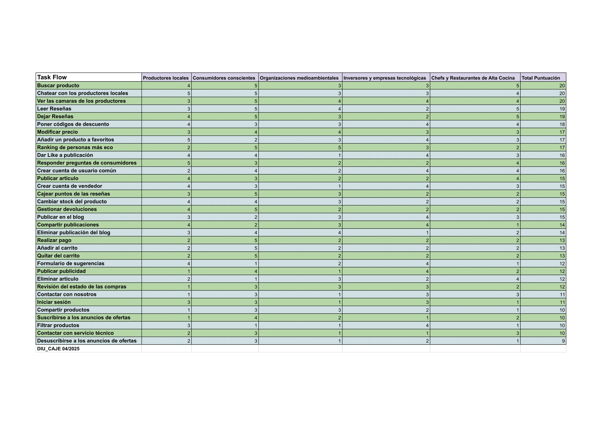
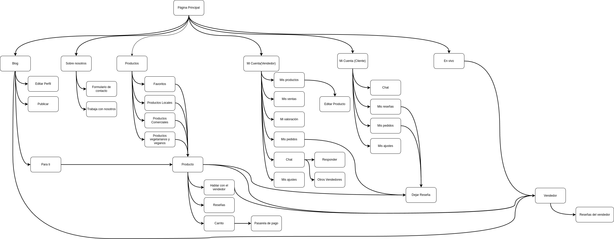
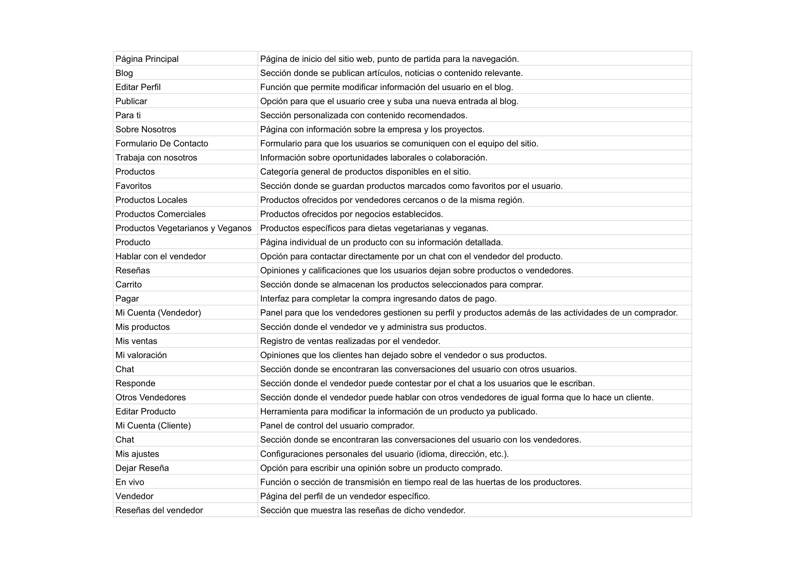
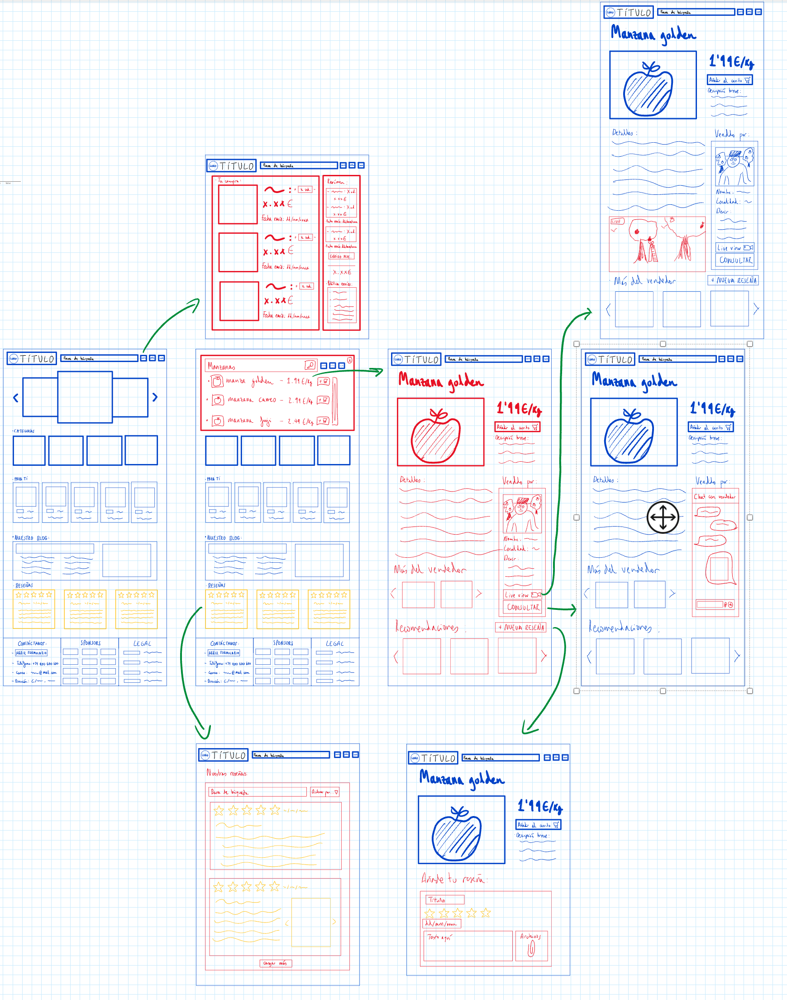
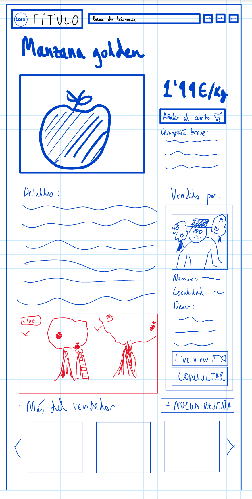
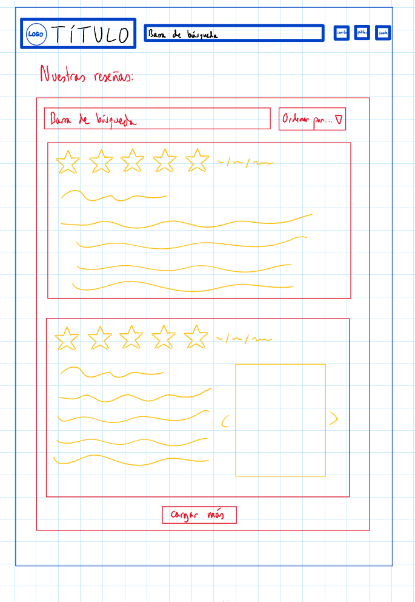
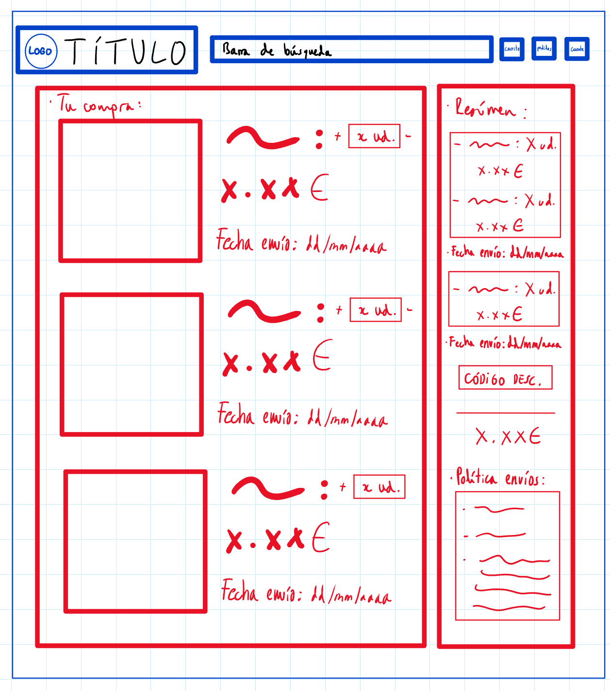

## DIU - Practica2, entregables

### Ideación 
* Malla receptora de información

* Mapa de empatía

### PROPUESTA DE VALOR
#### Econnection
En Econnection creemos que cuidar el planeta y cuidarnos a nosotros mismos no debería ser un lujo. Por eso conectamos productos ecológicos de calidad, tanto de pequeños productores locales como de marcas comprometidas a gran escala con personas que buscan vivir de forma más consciente. No se trata solo de lo que compras, sino de una comunidad que comparte una forma de vida que busca lo mejor para ellos y los demás compartiendo sus secretos de la cocina o poniendo a disposición de otros sus productos.

* ScopeCanvas

### TASK ANALYSIS

* User Task Matrix

* User/Task flow

### ARQUITECTURA DE INFORMACIÓN

* Sitemap

* Labelling 

### Prototipo Lo-FI Wireframe 

### Mapa general de los wireframes Lo-Fi:

### Buscar Producto

### Chatear con los productores locales

### Ver las cámaras de los productores en vivo

### Leer reseñas

### Dejar reseñas

### Poner códigos de descuento

### Conclusiones  
(incluye valoración de esta etapa)

>>>> Este fichero se debe editar para que cada evidencia quede enlazada con el recurso subido a la carpeta de la practica. Se pide más detalle técnico en las descripciones de lo que sería el README principal del repositorio y que corresponde a la descripcion del Case Study.
>>>> Termine con la seccion de Conclusiones para aportar una valoración final del equipo sobre la propia realización de la práctica
