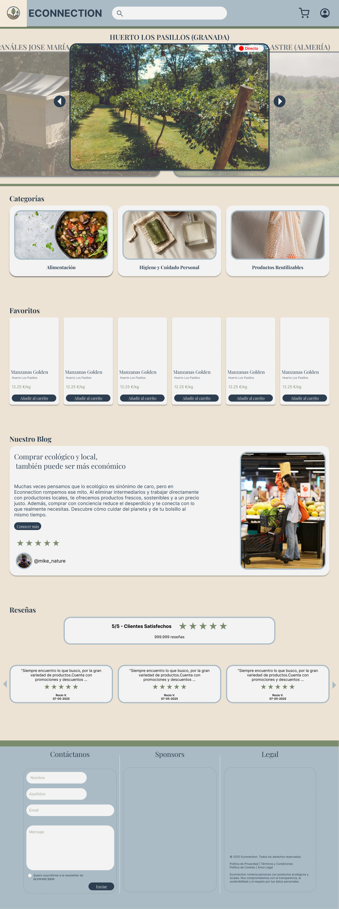
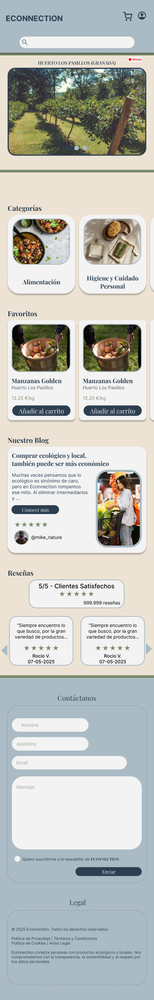
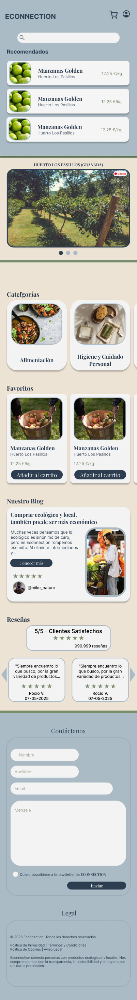
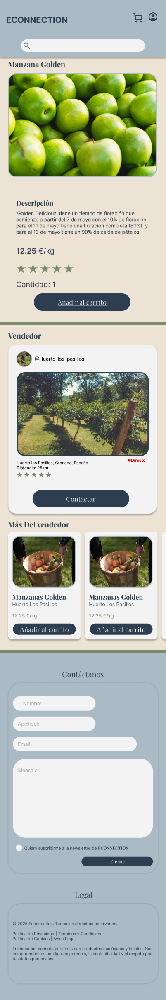
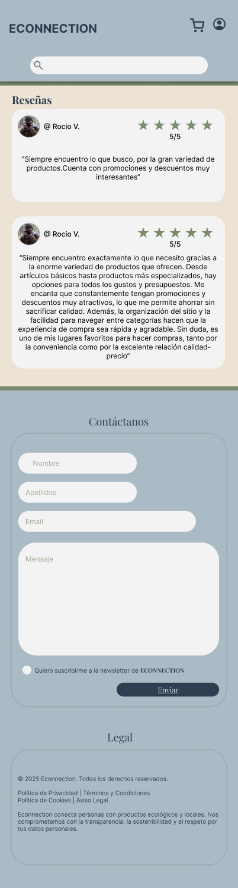

# DIU - Practica 3, entregables

- Moodboard (diseño visual + logotipo)   
- Landing Page
- Mockup: LAYOUT HI-FI
- Publicación del Case Study

### Moodboard

### Landing Page
La resolución del landing page es de 1440x3287.

### Mockup
Desde este [enlace](https://www.figma.com/proto/qLc8fQZwTATccx86u86e7Y/LandingPageEconnection?node-id=80-230&t=7UTSVONJVLbxbsSK-1&scaling=scale-down&content-scaling=fixed&page-id=0%3A1&starting-point-node-id=80%3A230) se puede acceder al Mockup.
 
1440x3857
 

 
402x2599
 

 
402x2916
 

 
402x2410
 

 
402x1494
 

## Conclusiones

>>>> Este fichero se debe editar para que cada evidencia quede enlazada con el recurso subido a la carpeta de la practica. Se pide más detalle técnico en las descripciones de lo que sería el README principal del repositorio y que corresponde a la descripcion del Case Study.
>>>> Termine con la seccion de Conclusiones para aportar una valoración final del equipo sobre la propia realización de la práctica
