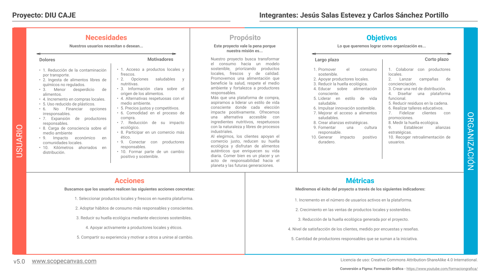
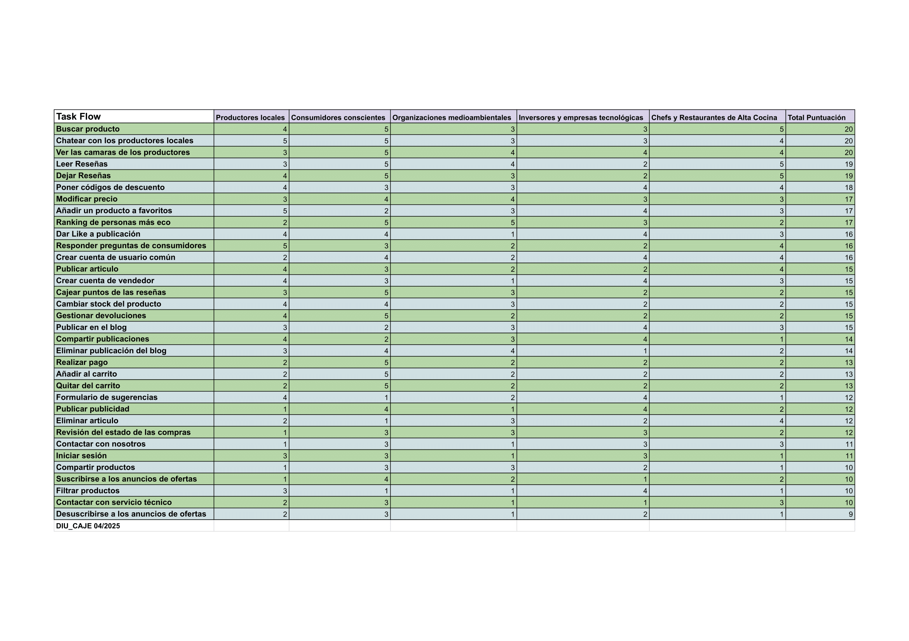
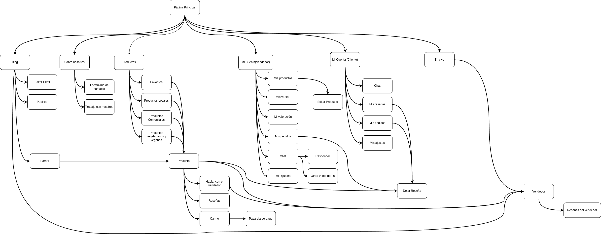
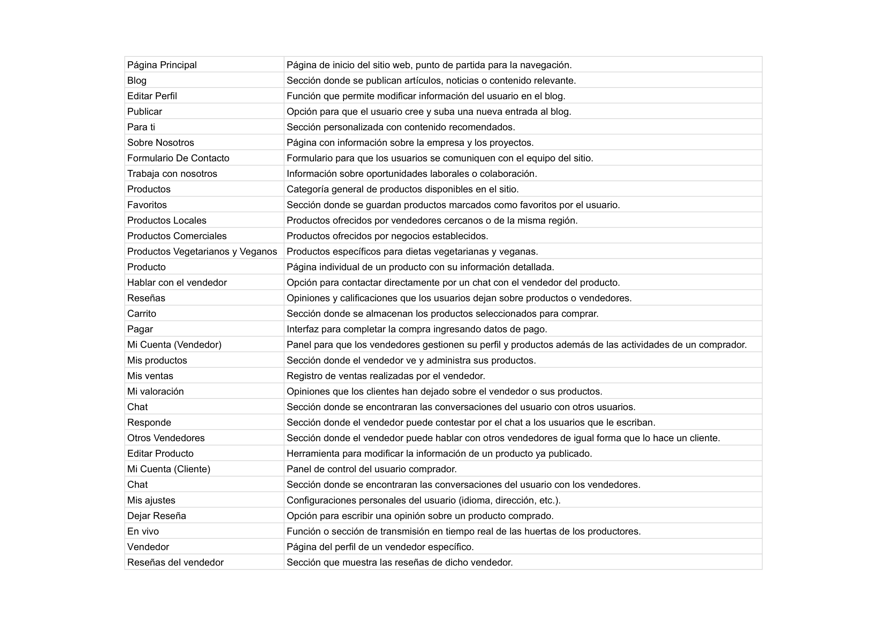
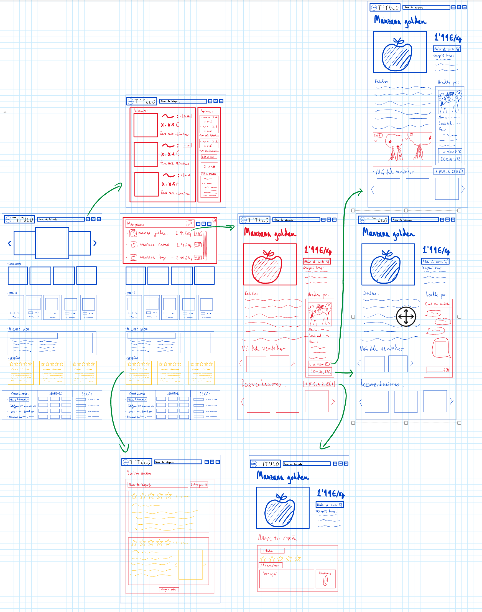
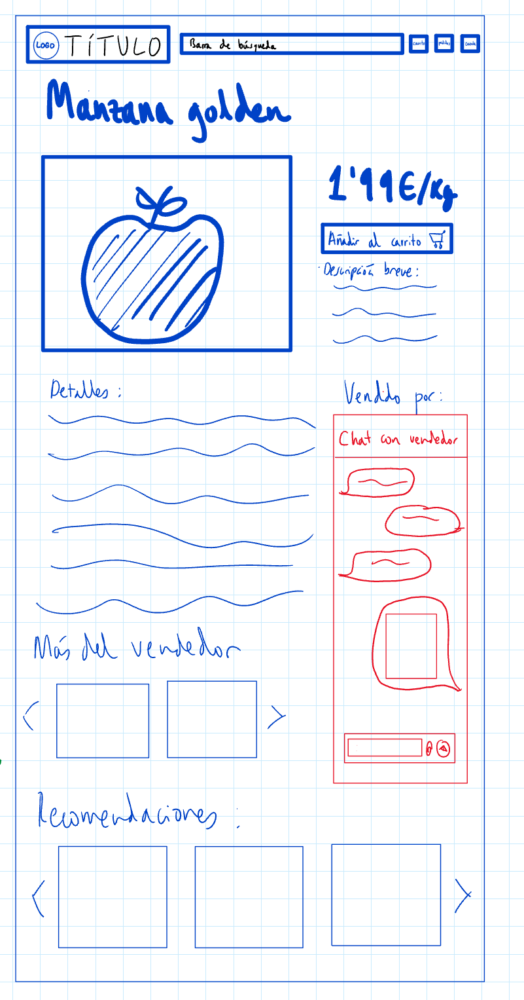
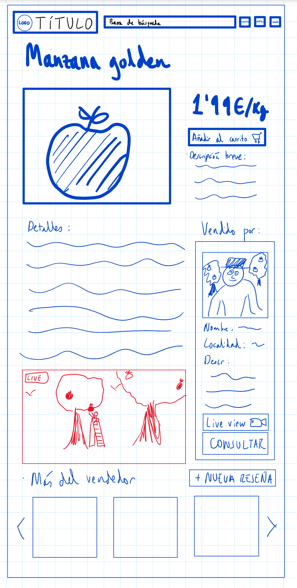
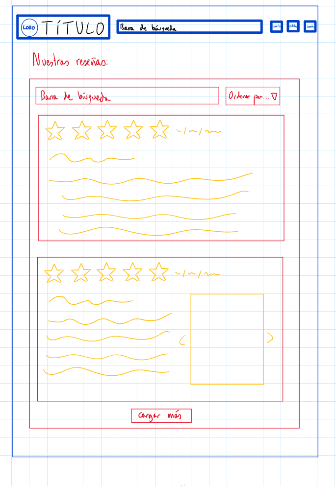
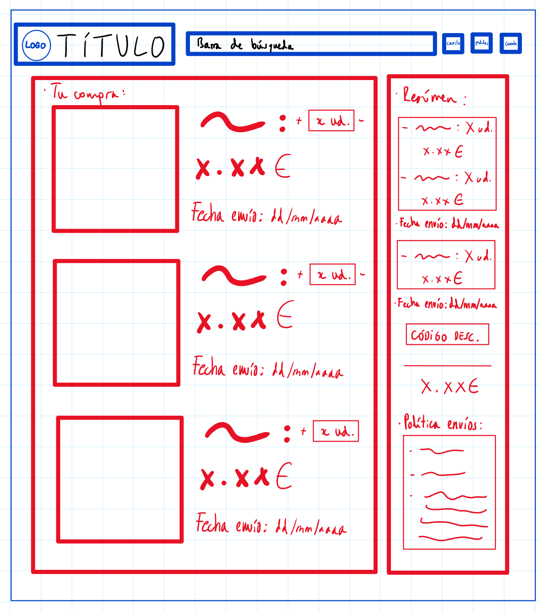

# DIU25
Prácticas Diseño Interfaces de Usuario (Tema: Mercados ecológicos) 

[Guiones de prácticas](GuionesPracticas/)

Grupo: DIU1_CAJE.  Curso: 2024/25 

Actualizado: 26/03/2025

Proyecto: 

ECONNECTION

Descripción: 

>>> Describa la idea de su producto en la práctica 2 

Logotipo: 

>>> Si diseña un logotipo para su producto en la práctica 3 pongalo aqui, a un tamaño adecuado. Si diseña un slogan añadalo aquí

Miembros:
 * :bust_in_silhouette:  Jesús Salas Estévez     :octocat: https://github.com/JesusSalasEstevez    
 * :bust_in_silhouette:  Carlos Sánchez Portillo     :octocat: https://github.com/carlossp04

----- 

# Proceso de Diseño 

 

## Paso 1. UX User & Desk Research & Analisis 

>>> Cualquier título puede ser adaptado. Recuerda borrar estos comentarios del template en tu documento

### 1.a User Reseach Plan
 
-----
El mercado de productos ecológicos representa un ecosistema complejo con múltiples actores interconectados. Los stakeholders principales incluyen:

- Productores locales: Agricultores, ganaderos y pequeños empresarios que generan productos ecológicos certificados. Su rol es fundamental como fuente primaria de productos sostenibles y garantes de prácticas agrícolas responsables.
  
- Consumidores conscientes: Personas cada vez más preocupadas por el origen, calidad y sostenibilidad de sus alimentos. Buscan transparencia, trazabilidad y un impacto positivo en el medio ambiente.
  
- Organizaciones medioambientales: Entidades que promueven la sostenibilidad, realizan investigaciones y presionan por regulaciones que favorezcan prácticas ecológicas.
  
- Inversores y empresas tecnológicas: Interesados en el potencial de crecimiento de este mercado, desarrollando soluciones innovadoras para mejorar la eficiencia y accesibilidad de los productos ecológicos.
  
- Chefs y Restaurantes de Alta Cocina: Un stakeholder emergente y crucial en el ecosistema de productos ecológicos. Los mejores restaurantes del mundo están revolucionando la gastronomía con un compromiso radical con la sostenibilidad. Chefs de renombre internacional como Massimo Bottura, René Redzepi o Virgilio Martínez lideran un movimiento que va más allá de la simple alimentación: se trata de una revolución culinaria basada en ingredientes de origen local, trazabilidad absoluta y mínimo impacto ecológico. Para estos profesionales, los mercados ecológicos no son solo un proveedor, sino un aliado estratégico. Buscan ingredientes con una historia, con un origen conocido, cultivados con respeto al ecosistema. Valoran no solo la calidad organoléptica, sino también el impacto social y medioambiental de cada producto. Son embajadores de una nueva filosofía gastronómica donde cada ingrediente cuenta una historia de sostenibilidad, tradición y compromiso con el planeta.

### 1.b Competitive Analysis
 
-----
En este análisis hemos tratado de valorar los pilares que podemos considerar fundamentales de los **Mercados Ecológicos** y en general de cualquier web que ofrece un servicio. Para ello realizamos una busqueda selectiva tratando de encontrar los que podrían ser nuestros mejores competidores a nivel local, como en este caso son Valle y Vega y Ecojaral pero también quisimos darle una perspectiva más global y encontramos GreenWeez o Naturitas. Pese a tratarse todas ellas de productos ecologicos o también conocidos como verdes, tienen puntos de vista distintos de como afrontar sus interfaces y servicios.

### 1.c Personas
 
-----

#### Lucía Gómez

Se trata de una chica que acaba de terminar sus estudios univesitarios, está preocupada por el cambio climático y es bastante aficionada al deporte. Todavía no es independiente económicamente de sus padres ya que está buscando trabajo y está muy interesada en la investigación.

#### Joao Ferreiro

>>> Junto con la captura de pantalla de la ficha de la persona, haz una breve descripción de la misma. Recuerda que son dos. Los recursos de imagen deberán estar dentro de la carpeta P1/ Cuando termines, borra esta línea.  

### 1.d User Journey Map
 
----
Las experiencias de ambos usuarios evidencian, por un lado, la desconfianza que puede generar una página web cuando no presenta una interfaz actualizada, especialmente al momento de realizar pagos, ya que esto puede hacer sospechar de posibles fraudes. Por otro lado, queremos destacar la importancia de que las funcionalidades de un sitio web estén diseñadas pensando en los usuarios. Personas en determinadas situaciones pueden tener dificultades para encontrar los productos que buscan debido a errores ortográficos o porque no se han contemplado sinónimos o variantes en los nombres de dichos productos.
### Journey Map de Lucía Gómez

#### Journey Map de Joao Ferreiro

>>> Describe el porqué de las dos experiencias de usuario contadas en el journey map. Por ejemplo, reflexiona si te parece que son habituales. Enlaza con los recursos journey que están en la carpeta P1/. Borra esta linea del template cuando termines.  

### 1.e Usability Review
 
----
En este documento podemos ver la valoranción numérica obtenida por el mejor de los competidores que hemos revisado.
[Revisión de usabilidad](https://docs.google.com/spreadsheets/d/10pyv0eafU9yzs6Yo7bgGHnGT2njIAScI/edit?usp=sharing&ouid=103161517094617397240&rtpof=true&sd=true)
 
La valoración obtenida ha sido de 98/100, por lo que es una valoración excelente, consta de contrastes de colores correctos, tamaños de texto y funcionalidades correctos, permiten la busqueda de sus productos de manera fluida y con ayuda. En general se trata de una experiencia de usuario bastante adecuada y correcta.
[Naturitas](https://www.naturitas.es/?srsltid=AfmBOorLQmoDiJQNFp7biN2QNQgT81CBblUAmDKjXQSUaMB6HjfJHaxV)

## Paso 2. UX Design  

>>> Cualquier título puede ser adaptado. Recuerda borrar estos comentarios del template en tu documento

### 2.a Reframing / IDEACION: Feedback Capture Grid / EMpathy map 
 
----
#### Ideación 
Sin embargo, la competencia no logra transmitir las emociones necesarias para que los usuarios comprendan que comprar productos ecológicos va más allá de una decisión arbitraria. No ofrecen una experiencia de usuario que comunique la relevancia de este tipo de consumo ni que refuerce el propósito de actuar en favor del planeta y de uno mismo. Esto resulta especialmente importante considerando que los productos ecológicos suelen tener precios significativamente más altos, lo que lleva a muchas personas a percibirlos como una fuente de dificultades más que como una solución.
 
* Malla receptora de información

* Mapa de empatía

#### Econnection
En Econnection creemos que cuidar el planeta y cuidarnos a nosotros mismos no debería ser un lujo. Por eso conectamos productos ecológicos de calidad, tanto de pequeños productores locales como de marcas comprometidas a gran escala con personas que buscan vivir de forma más consciente. No se trata solo de lo que compras, sino de una comunidad que comparte una forma de vida que busca lo mejor para ellos y los demás compartiendo sus secretos de la cocina o poniendo a disposición de otros sus productos.

### 2.b ScopeCanvas

----

>>> Propuesta de valor, pero ahora en vez de un texto es un ScopeCanvas que has subido a P2/ y enlazado desde aqui. Tambien vale una imagen miniatura del recurso.
>>> No olvides que tu propuesta ya tiene un nombre corto y puedes actualizar la cabecera de este archivo

### 2.b User Flow (task) analysis 
 
-----

>>> Definir "User Map" y "Task Flow" ... enlazar desde P2/ y describir brevemente

### 2.c IA: Sitemap + Labelling 
 
----

* Sitemap

* Labelling 

>>> Identificar términos para diálogo con usuario (evita el spanglish) y la arquitectura de la información. Es muy apropiado un diagrama tipo sitemap y una tabla que se ampliaría para llevar asociado la columna iconos (tanto para la web como para una app). 

### 2.d Wireframes
 
-----

### Chatear con los productores locales

### Ver las cámaras de los productores en vivo

### Leer reseñas

### Dejar reseñas

### Poner códigos de descuento

 

## Paso 3. Mi UX-Case Study (diseño)

### 3.a Moodboard

-----

>>> Diseño visual con una guía de estilos visual (moodboard) 
>>> Incluir Logotipo. Todos los recursos estarán subidos a la carpeta P3/
>>> Explique aqui la/s herramienta/s utilizada/s y el por qué de la resolución empleada. Reflexione ¿Se puede usar esta imagen como cabecera de Instagram, por ejemplo, o se necesitan otras?

### 3.b Landing Page
 
----
!(LandingPage)[P3/Landig%20Page.png]
>>> Plantear el Landing Page del producto. Aplica estilos definidos en el moodboard

### 3.c Guidelines
 
----

>>> Estudio de Guidelines y explicación de los Patrones IU a usar 
>>> Es decir, tras documentarse, muestre las deciones tomadas sobre Patrones IU a usar para la fase siguiente de prototipado. 

### 3.d Mockup
 
----

Este es el [enlace](https://www.figma.com/proto/qLc8fQZwTATccx86u86e7Y/LandingPageEconnection?node-id=80-230&t=7UTSVONJVLbxbsSK-1&scaling=scale-down&content-scaling=fixed&page-id=0%3A1&starting-point-node-id=80%3A230) al Mokup

### 3.e ¿My UX-Case Study?
 
-----

## Paso 4. Pruebas de Evaluación 

### 4.a Reclutamiento de usuarios 

-----

>>> Breve descripción del caso asignado (llamado Caso-B) con enlace al repositorio Github
>>> Tabla y asignación de personas ficticias (o reales) a las pruebas. Exprese las ideas de posibles situaciones conflictivas de esa persona en las propuestas evaluadas. Mínimo 4 usuarios: asigne 2 al Caso A y 2 al caso B.

| Usuarios | Sexo/Edad     | Ocupación   |  Exp.TIC    | Personalidad | Plataforma | Caso
| ------------- | -------- | ----------- | ----------- | -----------  | ---------- | ----
| User1's name  | H / 18   | Estudiante  | Media       | Introvertido | Web.       | A 
| User2's name  | H / 18   | Estudiante  | Media       | Timido       | Web        | A 
| User3's name  | M / 35   | Abogado     | Baja        | Emocional    | móvil      | B 
| User4's name  | H / 18   | Estudiante  | Media       | Racional     | Web        | B 

### 4.b Diseño de las pruebas 
 
-----

>>> Planifique qué pruebas se van a desarrollar. ¿En qué consisten? ¿Se hará uso del checklist de la P1?

### 4.c Cuestionario SUS
 
----

>>> Como uno de los test para la prueba A/B testing, usaremos el **Cuestionario SUS** que permite valorar la satisfacción de cada usuario con el diseño utilizado (casos A o B). Para calcular la valoración numérica y la etiqueta linguistica resultante usamos la [hoja de cálculo](https://github.com/mgea/DIU19/blob/master/Cuestionario%20SUS%20DIU.xlsx). Previamente conozca en qué consiste la escala SUS y cómo se interpretan sus resultados
http://usabilitygeek.com/how-to-use-the-system-usability-scale-sus-to-evaluate-the-usability-of-your-website/)
Para más información, consultar aquí sobre la [metodología SUS](https://cui.unige.ch/isi/icle-wiki/_media/ipm:test-suschapt.pdf)
>>> Adjuntar en la carpeta P4/ el excel resultante y describa aquí la valoración personal de los resultados 

### 4.d A/B Testing
 
-----

>>> Los resultados de un A/B testing con 3 pruebas y 2 casos o alternativas daría como resultado una tabla de 3 filas y 2 columnas, además de un resultado agregado global. Especifique con claridad el resultado: qué caso es más usable, A o B?

### 4.e Aplicación del método Eye Tracking 

----

>>> Indica cómo se diseña el experimento y se reclutan los usuarios. Explica la herramienta / uso de gazerecorder.com u otra similar. Aplíquese únicamente al caso B.

  
>>> Cambiar esta img por una de vuestro experimento. El recurso deberá estar subido a la carpeta P4/  

>>> gazerecorder en versión de pruebas puede estar limitada a 3 usuarios para generar mapa de calor (crédito > 0 para que funcione) 

### 4.f Usability Report de B
 
-----

>>> Añadir report de usabilidad para práctica B (la de los compañeros) aportando resultados y valoración de cada debilidad de usabilidad. 
>>> Enlazar aqui con el archivo subido a P4/ que indica qué equipo evalua a qué otro equipo.

>>> Complementad el Case Study en su Paso 4 con una Valoración personal del equipo sobre esta tarea

 

## Paso 5. Exportación y Documentación 

### 5.a Exportación a HTML/React
 
----

>>> Breve descripción de esta tarea. Las evidencias de este paso quedan subidas a P5/

### 5.b Documentación con Storybook

----

>>> Breve descripción de esta tarea. Las evidencias de este paso quedan subidas a P5/

 

## Conclusiones finales & Valoración de las prácticas

>>> Opinión FINAL del proceso de desarrollo de diseño siguiendo metodología UX y valoración (positiva /negativa) de los resultados obtenidos. ¿Qué se puede mejorar? Recuerda que este tipo de texto se debe eliminar del template que se os proporciona 

